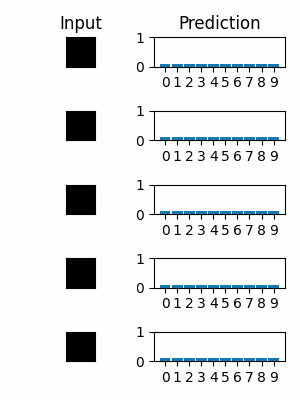

# Autoregressive 

This repository contains all the necessary PyTorch code, tailored to my [presentation](etc/presentation/autoregressive_presentation.pdf), to train and generate data from WaveNet-like autoregressive models.

For presentation purposes, the WaveNet-like models are applied to randomized Fourier series (1D) and MNIST (2D). In the figure below, two WaveNet-like models with different training settings make an n-step prediction on a periodic time-series from the validation dataset.
<div align="center">
 
</div>

Extended functions show how to generate MNIST images or how the MNIST digit class may be estimated (progressively) from observed pixels p(y|x) using a conditional WaveNet p(x|y=class) and Bayes' rule. Left: sampled MNIST digits, Right:progressive class estimates as more pixels are observed.

<div align="center">
 
 
</div>

Note, this does not implement (Gated) PixelCNNs, but unrolls images for the purpose of processing in the WaveNet.

## Features
Currently the following features are implemented
 - WaveNet architecture and training as proposed in (*oord2016wavenet*)
 - Conditioning support (*oord2016wavenet*)
 - Fast generation based on (*paine2016fast*)
 - Fully differentiable n-step unrolling in training (*heindl2021autoreg*)
 - 2D image generation, completion, classification, and progressive classification support based on MNIST dataset
 - A randomized Fourier dataset

## Presentation
A detailed presentation with theoretical background, architectural considerations and experiments can be found below.

<div align="center">
 <a href="etc/presentation/autoregressive_presentation.pdf"></a>
</div>

The presentation source as well as all generated images are public domain. In case you find it useful, please leave a citation (see References below). All presentation sources can be found in `etc/presentation`. The process is written in markdown using [Marp](https://marp.app/), graph diagrams are created using [yEd](https://www.yworks.com/products/yed).


## References

```bibtex

@misc{heindl2021autoreg, 
    title={Autoregressive Models}, 
    journal={PROFACTOR Journal Club}, 
    author={Heindl, Christoph},
    year={2021},
    howpublished={\url{https://github.com/cheind/autoregressive}}
}

@article{oord2016wavenet,
  title={Wavenet: A generative model for raw audio},
  author={Oord, Aaron van den and Dieleman, Sander and Zen, Heiga and Simonyan, Karen and Vinyals, Oriol and Graves, Alex and Kalchbrenner, Nal and Senior, Andrew and Kavukcuoglu, Koray},
  journal={arXiv preprint arXiv:1609.03499},
  year={2016}
}

@article{paine2016fast,
  title={Fast wavenet generation algorithm},
  author={Paine, Tom Le and Khorrami, Pooya and Chang, Shiyu and Zhang, Yang and Ramachandran, Prajit and Hasegawa-Johnson, Mark A and Huang, Thomas S},
  journal={arXiv preprint arXiv:1611.09482},
  year={2016}
}

@article{oord2016conditional,
  title={Conditional image generation with pixelcnn decoders},
  author={Oord, Aaron van den and Kalchbrenner, Nal and Vinyals, Oriol and Espeholt, Lasse and Graves, Alex and Kavukcuoglu, Koray},
  journal={arXiv preprint arXiv:1606.05328},
  year={2016}
}
```