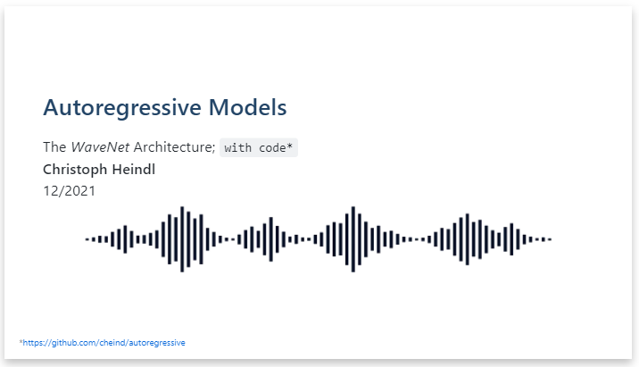

# Autoregressive 

This repository contains PyTorch that accompanies my [presentation](etc/presentation/autoregressive_presentation.pdf) on WaveNets and autoregressive models.

For presentation purposes, the WaveNet-like models are applied to randomized Fourier series. In the figure below, two WaveNet-like models with different training settings make an n-step prediction on a periodic time-series from the validation dataset.
<div align="center">
 
</div>

## Features
Currently the following features are implemented
 - WaveNet architecture and training as proposed in (oord2016wavenet).
 - Fast generation based on (paine2016fast).
 - A novel idea on n-step train-unrolling using Gumbel-softmax.
 - A randomized Fourier dataset.


## Presentation
Click the image below to access my presentation.

<div align="center">
 <a href="etc/presentation/autoregressive_presentation.pdf"></a>
</div>

## References

```bibtex

@misc{heindl2021autoreg, 
    title={Autoregressive Models}, 
    journal={PROFACTOR Journal Club}, 
    author={Heindl, Christoph},
    year={2021},
    howpublished={\url{https://github.com/cheind/autoregressive}}
}

@article{oord2016wavenet,
  title={Wavenet: A generative model for raw audio},
  author={Oord, Aaron van den and Dieleman, Sander and Zen, Heiga and Simonyan, Karen and Vinyals, Oriol and Graves, Alex and Kalchbrenner, Nal and Senior, Andrew and Kavukcuoglu, Koray},
  journal={arXiv preprint arXiv:1609.03499},
  year={2016}
}

@article{paine2016fast,
  title={Fast wavenet generation algorithm},
  author={Paine, Tom Le and Khorrami, Pooya and Chang, Shiyu and Zhang, Yang and Ramachandran, Prajit and Hasegawa-Johnson, Mark A and Huang, Thomas S},
  journal={arXiv preprint arXiv:1611.09482},
  year={2016}
}

@article{oord2016conditional,
  title={Conditional image generation with pixelcnn decoders},
  author={Oord, Aaron van den and Kalchbrenner, Nal and Vinyals, Oriol and Espeholt, Lasse and Graves, Alex and Kavukcuoglu, Koray},
  journal={arXiv preprint arXiv:1606.05328},
  year={2016}
}
```