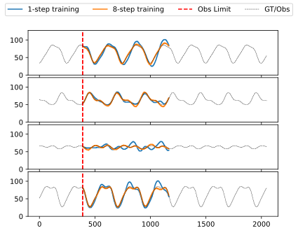

# Autoregressive 

This repository contains all the necessary PyTorch code, tailored to my [presentation](etc/presentation/autoregressive_presentation.pdf), to train and generate data from WaveNet-like autoregressive models.

For presentation purposes, the WaveNet-like models are applied to randomized Fourier series (1D) and MNIST (2D). In the figure below, two WaveNet-like models with different training settings make an n-step prediction on a periodic time-series from the validation dataset.
<div align="center">
 
</div>

Advanced functions show how to generate MNIST images and how to estimate the MNIST digit class (progressively) `p(y=class|x)` from observed pixels using a conditional WaveNet `p(x|y=class)` and Bayes rule. Left: sampled MNIST digits, right: progressive class estimates as more pixels are observed.

<div align="center">
 
 
</div>

*Note, this library **does not** implement (Gated) PixelCNNs, but unrolls images for the purpose of processing in WaveNet architectures. This works surprisingly well.*

## Features
Currently the following features are implemented
 - WaveNet architecture and training as proposed in (*oord2016wavenet*)
 - Conditioning support (*oord2016wavenet*)
 - Fast generation based on (*paine2016fast*)
 - Fully differentiable n-step unrolling in training (*heindl2021autoreg*)
 - 2D image generation, completion, classification, and progressive classification support based on MNIST dataset
 - A randomized Fourier dataset

## Presentation
A detailed presentation with theoretical background, architectural considerations and experiments can be found below.

<div align="center">
 <a href="etc/presentation/autoregressive_presentation.pdf"></a>
</div>

The presentation source as well as all generated images are public domain. In case you find them useful, please leave a citation (see References below). All presentation sources can be found in `etc/presentation`. The presentation is written in markdown using [Marp](https://marp.app/), graph diagrams are created using [yEd](https://www.yworks.com/products/yed).

*If you spot errors or if case you have suggestions for improvements, please let me know by opening an issue.*

## Installation
To install run,

```
pip install https://github.com/cheind/autoregressive.git#egg=autoregressive[dev]
```
which requires Python 3.9 and a recent PyTorch > 1.9

## Usage
The library comes with a set of pre-trained models in [`models/`](models/). The following commands use those models to make various predictions. Many listed commands come with additional parameters; use `--help` to get additional information.

### 1D Fourier

Sample new signals from scratch
```bash
python -m autoregressive.scripts.wavenet_signals sample --config "models/fseries/config.yaml" --ckpt "models/fseries/xxxxxx.ckpt" --condition 4 --horizon 1000
```
The default models conditions on the periodicity of the signal. For the pre-trained model the value range is `int: [0..4]`, corresponding to periods of 5-10secs.

--- 

Predict the shape of partially observable curves.
```bash
python -m autoregressive.scripts.wavenet_signals sample --config "models/fseries/config.yaml" --ckpt "models/fseries/xxxxxx.ckpt" --horizon 1500 --num_observed 50 --num_trajectories 20 --num_curves 1 --show_confidence true
```

### 2D MNIST

To sample from the class-conditional model
```bash
python -m autoregressive.scripts.wavenet_mnist sample --config "models/mnist_q2/config.yaml" --ckpt "models/mnist_q2/xxxxxx.ckpt"
```
---

Generate images conditioned on the digit class and observed pixels.
```bash
python -m autoregressive.scripts.wavenet_mnist predict --config "models/mnist_q2/config.yaml" --ckpt "models/mnist_q2/xxxxxx.ckpt" 
```

---

To perform classification
```bash
python -m autoregressive.scripts.wavenet_mnist classify --config "models/mnist_q2/config.yaml" --ckpt "models/mnist_q2/xxxxxx.ckpt"
```

## References

```bibtex
@misc{heindl2021autoreg, 
  title={Autoregressive Models}, 
  journal={PROFACTOR Journal Club}, 
  author={Heindl, Christoph},
  year={2021},
  howpublished={\url{https://github.com/cheind/autoregressive}}
}

@article{oord2016wavenet,
  title={Wavenet: A generative model for raw audio},
  author={Oord, Aaron van den and Dieleman, Sander and Zen, Heiga and Simonyan, Karen and Vinyals, Oriol and Graves, Alex and Kalchbrenner, Nal and Senior, Andrew and Kavukcuoglu, Koray},
  journal={arXiv preprint arXiv:1609.03499},
  year={2016}
}

@article{paine2016fast,
  title={Fast wavenet generation algorithm},
  author={Paine, Tom Le and Khorrami, Pooya and Chang, Shiyu and Zhang, Yang and Ramachandran, Prajit and Hasegawa-Johnson, Mark A and Huang, Thomas S},
  journal={arXiv preprint arXiv:1611.09482},
  year={2016}
}

@article{oord2016conditional,
  title={Conditional image generation with pixelcnn decoders},
  author={Oord, Aaron van den and Kalchbrenner, Nal and Vinyals, Oriol and Espeholt, Lasse and Graves, Alex and Kavukcuoglu, Koray},
  journal={arXiv preprint arXiv:1606.05328},
  year={2016}
}
```