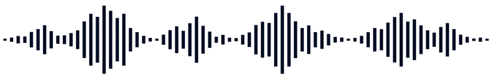
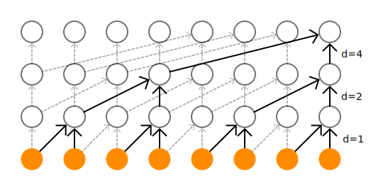
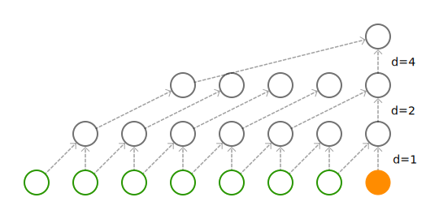
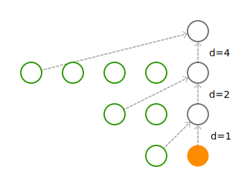
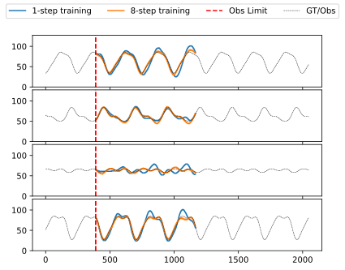
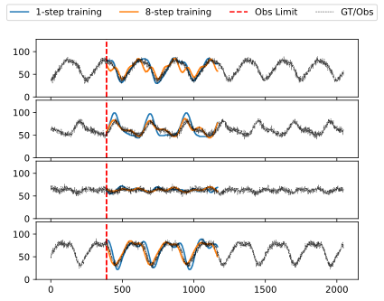
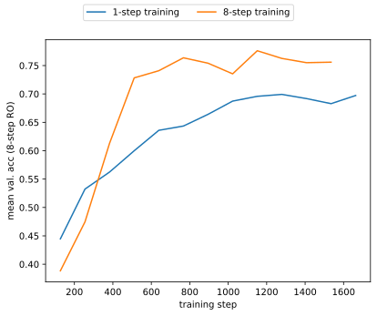
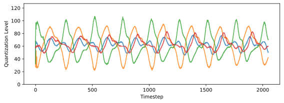
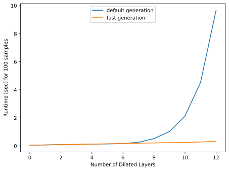

<!-- 
_class: lead
_paginate: false
 -->

# Autoregressive Models
The *WaveNet** Architecture
**Christoph Heindl**
12/2021

---
<!-- 
_footer: '*https://arxiv.org/abs/1609.03499'
_paginate: true
 -->
# WaveNet*

## Paper
Wavenet: A generative model for raw audio.
Oord, Aaron van den, et al.
[@deepmind](https://deepmind.com/blog/article/wavenet-generative-model-raw-audio), 2016

## Contributions
- Models the wave-form directly (16kHz)
- Generates one time sample at a time
- Capable of capturing important audio structure at many time-scales

Led to the **most natural-sounding** speech/audio at the time

---

# Content

This talk covers
 - an introduction to autoregressive models and their limitations,
 - the architectural ideas to overcome those limitations, and
 - few of existing improvements.

This talk is not
 - about audio/speech (we use Fourier series instead),
 - a comprehensive state-of-the-art presentation on generative models.

---

# Background

--- 

# Generative Models

Generative models build a distribution over the data itself. Consider a set of random variables 
$$
\mathbf{X}=\{X_1,X_2,X_3\},
$$
then a generative model estimates 
$$
p(\mathbf{X}).
$$
This is in contrast discriminative models, which model conditional distributions, e.g. $p(X_3 \mid X_2,X_1)$. 

Given the joint distribution, we can generate *new* data via sampling 
$$
\mathbf{x} \sim p(\mathbf{X}).
$$

---

# Chain Rule of Probability

Allows us to break down $p(\mathbf{X})$ into a product of single-variable conditional distributions. 
$$
\begin{align*}
p(\mathbf{x}) &= p(X_3 \mid X_2,X_1)p(X_2 \mid X_1)p(X_1)\\
&=p(X_1 \mid X_2,X_3)p(X_3 \mid X_2)p(X_2)\\
&\ldots
\end{align*}
$$

When thinking about random time series, the first break-down leads to...

---

# Autoregressive Models

Given a set of time dependent random variables $\mathbf{X}=\{X_1,X_2,X_3...,X_T\}$, we represent their joint distribution as
$$
\begin{align*}
p(\mathbf{X}) &= \prod_{i=1}^Tp(X_i\mid \mathbf{X}_{j<i})\\
&=p(X_1)p(X_2 \mid X_1)p(X_3 \mid X_2, X_1)\ldots.
\end{align*}
$$

This induces a form of **causality**, as the distribution over a future variable depends on all previous observations.

---

# Dilated Convolutions
<!--_footer: Note, how each input (orange) within the receptive field is used exactly once.-->
Receptive field of dilated convolutions grows exponentially while parameters increase only linearly.

In general, each layer with dilation factor $D_i$ and kernel size $K_i$ adds
$$
 r_i = (K_i-1)D_i
$$
to the receptive field $R=\sum_i r_i$.

---

# Causal Padding

Causal padding (left-padding) ensures that convoluted features do not depend on future values. Two possibilities: input-padding (left), layer-padding (right)

 

In general, a total $P=R-1$ paddings is required.

<!--_footer: Autoregressive library uses layer-padding, WaveNet paper suggest input padding.-->
---

# Train-Unrolling Results

N-step forecast comparison between two models trained with and without unrolling on Fourier-series dataset with up to 4 terms.

## Conclusion
(+) Decreases generative drift
(+) Improves recreation of higher frequency patterns
(-) Increases training time (rolling origin)
(-) Sparser losses

---

# Train-Unrolling Results

N-step prediction based on noisy observations - comparison between two models trained with and without unrolling on a clean Fourier series dataset with up to 4 terms.

## Conclusion
(+) Both models capture global trends
(-) Accuracy of both modes decreases

---

# Train-Unrolling Results

8-step rolling origin validation comparison between models trained with and without unrolling on Fourier-series dataset with up to 4 terms.

## Conclusion
(+) Generally higher validation acc. at earlier training epochs.
(+) Similar picture if validation unrolling > train unrolling steps.

---

# Generative Results

The following graph shows four samples drawn from the models' prior distribution.

---

# Runtime Performance Results
<!-- _footer: '*Performed on a 1080 Ti' -->
The plot to the left shows default (blue) and fast (orange) sample generation* using 64 wave-channels, 8 quantization levels and 32 batch-size.

## Conclusion
(+) Fast method avoids exponential inference time as layer depth increases.
(-) Code overhead is considerable.

