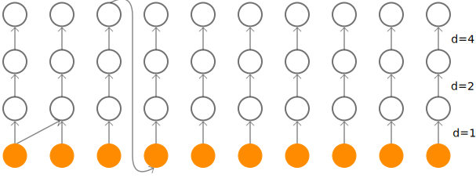

<!-- 
_class: lead
_footer: https://github.com/cheind/autoregressive
 -->

# Autoregressive Models
**Christoph Heindl**
12/2021

---

# Autoregressive

Given a set of random variables $\mathbf{x}=\{x_1,x_2,x_3...,x_T\}$, we model their joint
$$
\begin{align*}
p(\mathbf{x}) &= \prod_{i=1}^Tp(x_i\mid \mathbf{x}_{j<i})\\
&=p(x_1)p(x_2 \mid x_1)p(x_3 \mid x_2, x_1)\ldots,
\end{align*}
$$
always ok (chain rule).

---

# WaveNets

Here comes some text, then the image

 

Then again, text.