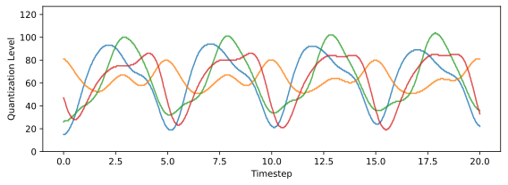
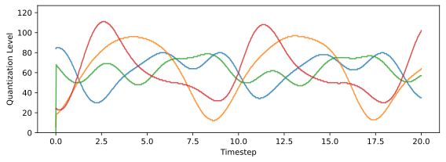
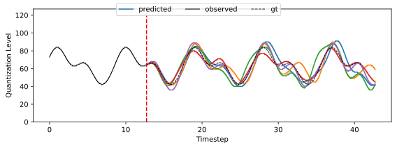
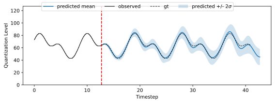
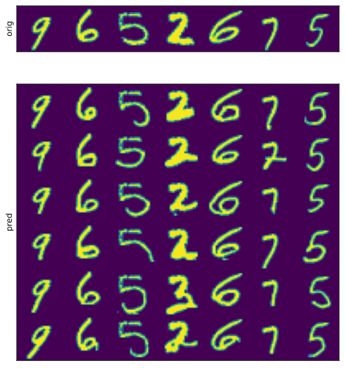
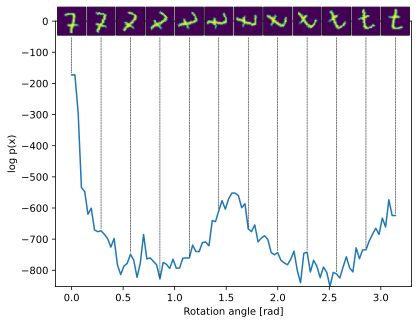
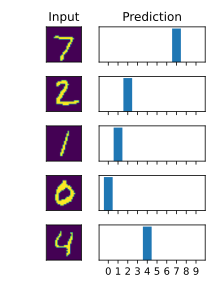

<!-- footer: 'Christoph Heindl | https://github.com/cheind/autoregressive | 2021' -->
<!-- 
_class: lead
_paginate: false
 -->

# Autoregressive Models
The *WaveNet* Architecture; `with code*`
**Christoph Heindl**
12/2021

---
<!-- 
_footer: '*https://arxiv.org/abs/1609.03499'
_paginate: true
 -->
# WaveNet*

Wavenet: A generative model for raw audio.
Aaron van den Oord, et al.
[@deepmind](https://deepmind.com/blog/article/wavenet-generative-model-raw-audio),  2016

## Contributions
- Generative model for wave-form forms
- Capable of capturing important audio structure at many time-scales
- Conditioning support

Led to the **most natural-sounding** speech/audio synthesis at the time.

---

# Content

This talk covers
 - an introduction to autoregressive models and some of their limitations,
 - the architectural ideas to overcome those limitations, and
 - few of existing improvements.

This talk is not
 - about audio/speech (we use time series / images instead),
 - a comprehensive state-of-the-art presentation on generative models.

Accompanying code: https://github.com/cheind/autoregressive

---

# Background

--- 

# Generative Models

Generative models build a distribution over the data itself. Consider a set of random variables 
$$
\mathbf{X}=\{X_1,X_2,X_3\},
$$
then a generative model estimates 
$$
p(\mathbf{X}).
$$
--- 

# Generative Model Applications
Given the joint distribution, we can carry out a number of tasks using our model
1. Generate novel data: $\mathbf{x} \sim p(\mathbf{X})$
1. Estimate density of observations: $p(\mathbf{X}=\mathbf{x})$
1. Perform conditional inference: $p(X_3|X_2=x_2, X_1=x_1)$

In the experiments below we will also see how to use conditioning to perform MNIST classification.

---

# Chain Rule of Probability

Allows us to break down $p(\mathbf{X})$ into a product of single-variable conditional distributions
$$
\begin{align*}
p(\mathbf{X}) &= p(X_3 \mid X_2,X_1)p(X_2 \mid X_1)p(X_1)\\
&=p(X_1 \mid X_2,X_3)p(X_3 \mid X_2)p(X_2)\\
&\ldots
\end{align*}
$$

---

# Autoregressive Models

---

# Autoregressive Models

Given a set of (time-)ordered random variables $\mathbf{X}=\{X_1,X_2,X_3...,X_T\}$, we represent their joint distribution as
$$
\begin{align*}
p(\mathbf{X}) &= \prod_{i=1}^Tp(X_i\mid \mathbf{X}_{j<i})\\
&=p(X_1)p(X_2 \mid X_1)p(X_3 \mid X_2, X_1)\ldots.
\end{align*}
$$

This induces a form of **causality**, as the distribution over a future variable depends on all previous observations. It also allows us to generate *new* data one sample point at a time (conditioned on all the previous ones).

---
# Lagged Autoregressive Models

For computational reasons, one usually limits the number of past observations influencing future predictions.
An autoregressive model of order/lag/receptive-field $R$ is defined as
$$
\begin{equation*}
X_t\,|\,\mathbf{X}_{j<t} = \theta_0 + \sum_{i=1}^{R} \theta_i X_{t-i} + \epsilon_t,
\end{equation*}
$$
where $\mathbf{\theta}=\{\theta_0,...,\theta_R\}$ are the parameters of the model and $\epsilon_t$ is (white) noise.

---
# Translation to Neural Networks
The definition of autogressive models can be captured by a single fully connected neural layer
$$
\begin{align*}
X_t\,|\,\mathbf{X}_{j<t} &= \theta_0 + \sum_{i=1}^{R} \theta_i X_{t-i} + \epsilon_t \\
&= \mathbf{\theta}^T\mathbf{h}_t+ \epsilon_t,
\end{align*}
$$
where $\mathbf{\theta} = \begin{pmatrix} \theta_0 & \theta_1 &\ldots & \theta_R \end{pmatrix}$ are the weights including the bias, and $\mathbf{h}_t = \begin{pmatrix} 1 & X_{t-1} & \ldots & X_{t-R} \end{pmatrix}$. 

## Deep models

For more model capacity, one might stack layers having multiple features, in which case we get something along the following line
$$
\begin{equation*}
\mathbf{H}^l_t = \sigma\left(\mathbf{\Theta}^l\mathbf{H}_t^{l-1} + \mathbf{\Epsilon}^l_t\right),
\end{equation*}
$$
where $\sigma$ is a non-linearity and subscript $l$ denotes the $l$-th layer.

---

# Limitations

1. **Training** with linear layers is **inefficient** as autoregressive value needs 
to be computed for every possible window of size $R$.
1. The **number of weights** grows linearily with the receptive field of the model.
For multi-time scale models (speech, audio) this becomes quickly an issue.

---

# WaveNet

---

# Convolutions: Improving Training Efficiency

Interpret $X_t\,|\,\mathbf{X}_{j<t}$ in terms of convolution. Allows for a fully-convolutional computation of all $X_t$ in one sweep. Below illustration is for a model of $R=3$.

### Need to be careful about (see Causal Padding slides)
 - Ensure no data leakage happens (i.e input restricted to $\mathbf{x}_{j<t}$)
 - How to handle variables $X_{t}$, where $t<R$

---

# Dilated Convolutions: Exponential Receptive Fields 

<!--_footer: Note, how each input (orange) within the receptive field is used exactly once.-->
Receptive field of dilated convolutions grows exponentially while parameters increase only linearly. Figure below uses kernel size $K_i=2$.

In general, each layer with dilation factor $D_i$ and kernel size $K_i$ adds
$$
 r_i = (K_i-1)D_i
$$
to the receptive field $R=\sum_i r_i + 1$.

---

# Dilated Convolutions: Number of parameters

Assume kernel size $K_i=2$ and a receptive field of $R=512$. Then a vanilla convolution requires
$$
R_{\textrm{vanilla}} = 512\;\text{parameters}
$$
(without a bias), while a stacked dilated convolution requires
$$
R_{\textrm{dilated}} = 2*9=18\;\text{parameters}.
$$

**Note**: stacked dilated convolutions make use of all 512 inputs.

---

# Causal Padding

Causal padding (left-padding) ensures that convoluted features do not depend on future values and allows us to compute predictions for $X_{t}$, where $t<R$ . Two possibilities: input-padding (left), layer-padding (right)

 

In general, a total of $P=R-1$ padding values are required.

<!--_footer: Autoregressive library uses layer-padding, WaveNet paper suggest input padding.-->
---
# Full Architecture

WaveNet combines stacked dilated convolutions, causal padding and gated activation functions to predict a categorical distribution for $X_t|\mathbf{X}_{j<t}$ in parallel.

---
# Training

Paper performs a one-step rolling origin training routine using cross entropy as loss function. 

Raw audio data is quantized to 256 bins and one-hot encoded ($X_t \sim Cat(\pi_1,\ldots,\pi_{256})$). 

Side note: one-step loss does not account for generative n-step drift (which is probably ok for audio synthesis).

---
# Data Generation

New data is generated one sample at a time. The figure below shows two steps for a model with $R=3$

Remarks:
- Generation is inefficient - requires $R$ inputs but uses only the last output.
- Generation involves sampling from the distribution.

---

# Extensions

---
# Conditional WaveNets*
Condition the model on additional external input
$$
\begin{align*}
p(\mathbf{X}\mid \mathbf{y}) &= \prod_{i=1}^Tp(X_i\mid \mathbf{X}_{j<i}, \mathbf{y})\\
&=p(X_1 \mid \mathbf{y})p(X_2 \mid X_1, \mathbf{y})p(X_3 \mid X_2, X_1, \mathbf{y})\ldots.
\end{align*}
$$
to change generative behavior. For example $\mathbf{y}$ might represent speaker identity in which case the model would generate data wrt. the given speaker.

<!--_footer: '*Wavenet: A generative model for raw audio, Aaron van den Oord, et al., 2016 '-->
---

# Faster Generation*
Relies on sparsity of access during computation. Introduce *queues* (i.e rolling buffers of size $r_i+1$) to store intermediate outputs. During generation only use oldest in queue and update queue.

Similar to updates in recurrent neural nets.

<!--_footer: '*Fast WaveNet Generation Algorithm, Tom le Paine et al., 2016.   For even faster generation check Parallel WaveNet: Fast High-Fidelity Speech Synthesis, Aaron van den Oord et al., 2017.'-->

---
# Train Unrolling*

In training, WaveNet uses a one-step rolling-origin loss which can causes substantial drift. 

## Idea

A n-step loss would allow the model to correct its own drift. 
I.e we want to apply n-step generation and backprop through all samples. 

## Issue
How to backprop through a random sample from a categorical distribution?

<!--_footer: '*TBD, Christoph Heindl, 2021 (unpublished)'-->
---
# Fully Differentiable Train Unrolling

## Reparametrization Idea
Note if $X_t \sim \mathcal{N}(\mu,\sigma)$, which we can express as $X_t \sim \mathcal{N}(0,1)\sigma + \mu$. 

Now $\frac{\partial}{\partial \mu}$, $\frac{\partial}{\partial \sigma}$ exist and randomness becomes an input (for which we do not require gradients).

## Reparametrization of Categorical Distributions

Similar reparametrization exists for $X_t \sim \mathcal{Cat}(\pi_1,\ldots,\pi_C)$ using Gumbel distribution*, which allows us to write 
$$
X_t \sim g(Gumbel(0,1),\pi_1, \ldots ,\pi_C,\tau),
$$
such that $\frac{\partial{g}}{\partial \pi_i}$ exists. Here $\tau$ is a temperature scaling parameter.
<!--_footer: 'Categorical Reparameterization with Gumbel-Softmax, Eric Jang et al., 2017  The Concrete Distribution: A Continuous Relaxation of Discrete Random Variables, C. Maddison et al., 2017 - '-->

---
# Fully Differentiable Train Unrolling

---
# Image Domain

The WaveNet idea extends to 2D spatial domain*. In this library the most straightforward approach is chosen: unrolling the image to a 1D signal. A 3x3 image (left) is unrolled using scanline approach to a 1D signal (right), which can then be fed to a standard WaveNet.

<!-- _footer: 'Oord, Aaron van den, et al. "Conditional image generation with pixelcnn decoders." arXiv preprint arXiv:1606.05328 (2016).' -->
---
# 1D Signal Experiments
---

# 1D Signal Setup

Instead of audio waveforms as input, using a Fourier dataset with randomized coefficients, number of terms and periodicity (sampling: 50Hz, quantization: 127 bins, encoding one-hot, conditioned on periodicity between 5-10secs)

---
# Sampling Results
The following diagrams show multiple samples $\mathbf{x} \sim p(\mathbf{X}|Y=\textrm{period})$: short periods (~5secs), longer periods (~10secs). 

---
# Prediction Results
In the following diagrams, multiple samples from the distribution $\mathbf{x} \sim p(\mathbf{X}_{>\textrm{obs}}|\mathbf{X}_{\le \textrm{obs}},Y)$ are shown. That is, the model predicts the future signal shape. Observe that for periodic signals, only little drift occurs as the horizon increases.

---
# Prediction Results - Confidence Bounds
We can interpret each future trajectory as a sample from the distribution $\mathbf{x} \sim p(\mathbf{X}_{>\textrm{obs}}|\mathbf{X}_{\le \textrm{obs}},Y)$. Sampling enough trajectories, allows us to estimate confidence bounds of the model as shown below

---

# Train-Unrolling Results

N-step forecast comparison between two models trained with and without unrolling on Fourier-series dataset with up to 4 terms.

## Conclusion
(+) Decreases generative drift
(+) Improves recreation of higher frequency patterns
(-) Increases training time (rolling origin)
(-) Sparser losses

---

# Noisy Train-Unrolling Results

N-step prediction based on noisy observations - comparison between two models trained with and without unrolling on a clean Fourier series dataset with up to 4 terms.

## Conclusion
(+) Both models capture global trends
(-) Accuracy of both modes decreases

---

# Train-Unrolling Validation Acc. Results

8-step rolling origin validation comparison between models trained with and without unrolling on Fourier-series dataset with up to 4 terms.

## Conclusion
(+) Generally higher validation acc. at earlier training epochs.
(+) Similar picture if validation unrolling > train unrolling steps.

---

# Runtime Performance Results
<!-- _footer: '*Performed on a 1080 Ti' -->
The plot to the left shows default (blue) and fast (orange) sample generation* using 64 wave-channels, 8 quantization levels and 32 batch-size.

## Conclusion
(+) Fast method avoids exponential inference time as layer depth increases.
(-) Code overhead is considerable.

---
# 2D Image Experiments

---
# 2D Image Setup

We use the MNIST dataset, which consists of images taken from 10 digit classes (0..9). 
Sampling: 28x28pixels, quantization: 256 bins / 2 bins, encoding one-hot.
Train/Val/Test splits as suggested.

---

# MNIST Sampling Results
Samples drawn from $p(\mathbf{X}\mid Y)$, where $\mathbf{X}$ is an MNIST 28x28 random variable and $Y$ is the digit conditioned on. Quantization 256.

Note
- Almost all generated images contain human recognizable digits of the given target class.
- Fading effect to soften hard edges is captured by the model

Side note on Z-filling curves
- I played around with other z-filling curves for unrolling such as Peano curves, but the results have been considerably worse. I believe that's due to the effect that the distance to the north pixel varies across image columns.

---

# MNIST Prediction Results

MNIST image reconstructions drawn from 
$$
p(X_{N+1},\ldots,X_{T} \mid X_1,\ldots,X_{N},Y),
$$
where $X_i$ denotes a random variable corresponding to the i-th (unrolled) MNIST 28x28 image pixel value and $y$ is the digit class. 

Top row: input images from the test set, of which the first 50% of all pixels are considered to be observed. Bottom rows: Predicted reconstructions.

Note
- Digit style is maintained during generation (thick strokes vs. thin strokes).
- Model capable of varying the global appearance (see second 7).
- Fading effect to soften hard edges is captured by the model.

---

# MNIST Density Estimation Results
Assuming we know the class probabilities $p(Y)=\frac{1}{|Y|}$, we can compute the marginal image probability as follows
$$
p(\mathbf{X}=\mathbf{x}) = \sum_{y_i=1}^Y p(\mathbf{X}=\mathbf{x}|Y=y_i)p(Y=y_i).
$$
For computational reasons, we instead compute in the library
$$
\log p(\mathbf{X}=\mathbf{x}) = \log \sum_{y_i=1}^Y \exp\left[\log p(\mathbf{X}=\mathbf{x}|Y=y_i)p(Y=y_i)\right].
$$

The image on the right shows log probabilities as a single input image is incrementally rotated.

---

# MNIST Classification Results
Given the class probabilities $p(Y)$, we compute from Bayes
$$
p(Y|\mathbf{X}=\mathbf{x}) = \frac{p(\mathbf{X}=\mathbf{x}|Y)p(Y)}{p(\mathbf{X}=\mathbf{x})}.
$$
A sample classification is shown on the right. 

## Accuracy
The 256 quantized model achieves an accuracy of 94% on MNIST test, while the binarized model yields a 98.7% accuracy score.

---
# MNIST Progressive Classification Results
In this scenario, we consider pixels to become available incrementally over time and observe how $p(Y|\mathbf{X}_{0...H})$ evolves as $H$ approaches $T$=784. The image below plots (from left to right) $p(Y|\mathbf{X}_{0...H})$ for $H$=85, $H$=281 and $H$=589.

<!-- 
_footer: 'See https://media.giphy.com/media/TsM2qbgxGwi3QPrIkk/giphy.gif for an animated version'
 -->

